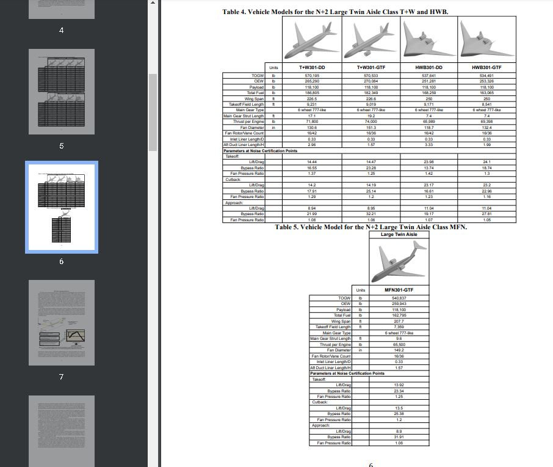
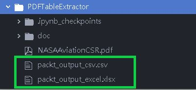
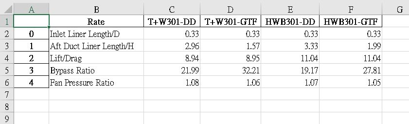
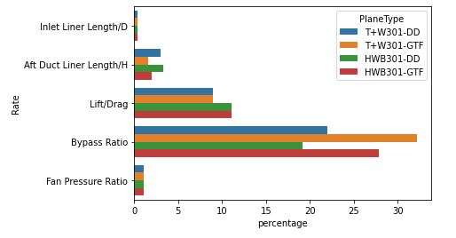

# PythonPDFTableExtractor
a python script that extracts table and output as csv or xlsx from PDF files

# Project Overview
- reading PDF files with Camelot and extract information for specified areas
- process loaded information with pandas and output as csv and xlsx
- (additional features) processed csv has more felixibility in analytics or plots (using seaborn)
- the project can be scalable to other pdf series that have fixed format
- camelot has more flexibility to tweak table extraction, hence serving as a backup solution incase other tool fails to precess the pdf

# Project Demo
- Original input: a pdf containining tables (here we use a pdf of a [CSR project from Nasa](https://ntrs.nasa.gov/api/citations/20160007659/downloads/20160007659.pdf) as example)

- Excel & csv output will be generated in the same directoty upon running the program

    - excel sample
    - 
- (Additional) data in dataframe can further be drew as plots

